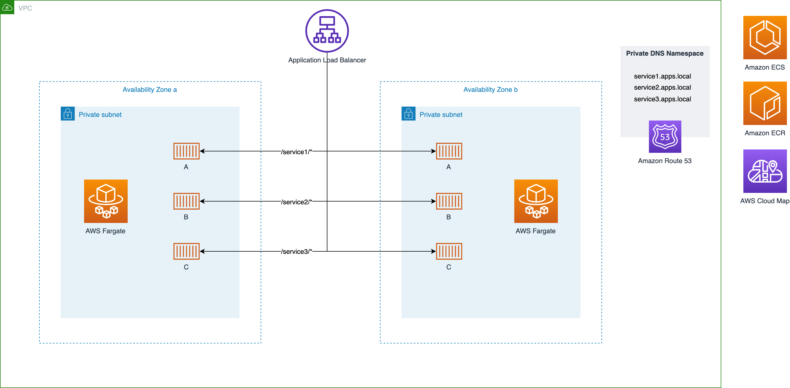

# Path-based microservices routing with ALB and AWS Fargate

This CDK app allows you to easily deploy Docker images that reside in ECR with AWS Fargate behind an Application Load Balancer with path-based routing.

## Architecture



## Getting started

First, set up the configuration file `fargate_config.json` to pass the parameters of your microservices application. You can define the following parameters:

* `"cidr"`: The cidr block for the VPC that is created for the cluster
* `"containers"`: An array of container objects, each container defines one of your dockerized microservices
* `"service_name"`: The name of the microservice
* `"ecr_repo"`: The name of the ECR repository where the Docker images resides. The app will always take the `:latest` tag, unless specified otherwise.
* `"alb_routing_path"`: The URL path that defines to which service the load balancer will route the request
* `"num_tasks"`: The number of desired tasks per service


The structure of the file is as follows:
```json
{
    "region": "eu-central-1",
    "cidr": "10.0.0.0/16",
    "containers": [
        {
            "service_name": "service1",
            "ecr_repo": "service1-nginx",
            "alb_routing_path": "/service1/*",
            "num_tasks": 2
        },
        {
            "service_name": "service2",
            "ecr_repo": "service2-nginx",
            "alb_routing_path": "/service2/*",
            "num_tasks": 3
        }
    ]
}
```

Finally, deploy the stack with the CDK command.
```bash
# Deploy the stack
cdk deploy
```

## Set up some sample Docker images
Make sure that your container serves the content in the corresponding path. To try out this infrastructure quickly, you can set up a several nginx images that serve a static HTML page. To serve a single static file from all URL paths, copy a different `index.html` to `/usr/share/nginx/html` for each Docker image and configure nginx as:
```nginx
server {
    listen 80;
    root /usr/share/nginx/html;
    location / {
        try_files /index.html /index.html;
    }
}
```

The simplest Dockerfile you can use would look something like this:
```Dockerfile
FROM nginx
RUN rm /etc/nginx/conf.d/default.conf
COPY nginx.conf /etc/nginx/conf.d/
COPY . /usr/share/nginx/html
```

Then, push your images to ECR following [this](https://docs.aws.amazon.com/AmazonECR/latest/userguide/docker-push-ecr-image.html) tutorial.

## Further reading
* https://docs.aws.amazon.com/elasticloadbalancing/latest/application/tutorial-load-balancer-routing.html
* ...

